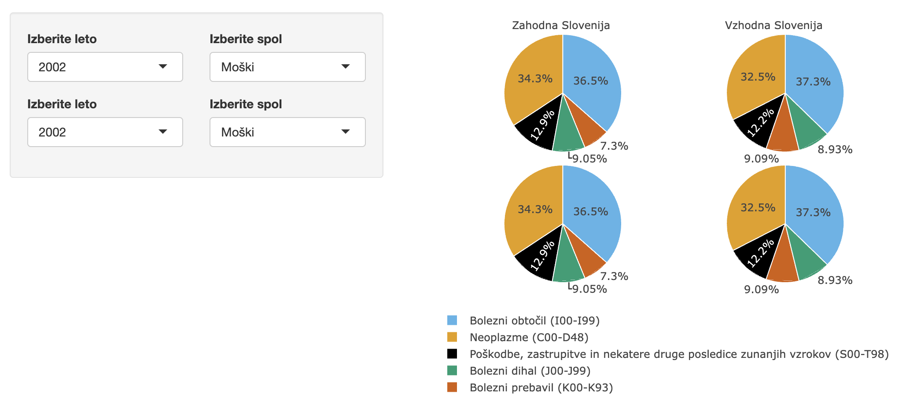

```{r setup, include=FALSE}
knitr::opts_chunk$set(echo = TRUE)
#devtools::install_github("teunbrand/ggh4x")
library(shiny)
library(plotly)
library(dplyr)
library(tidyverse)
library(highcharter)
library(tidyr)
library(geofacet)
library(ggh4x)
library(streamgraph)
library(hrbrthemes)
library(ggtext)
library(viridis)
```

```{r include=FALSE}
#podatki = read.csv("podatki.csv", sep=';')

podatki = read.csv("podatki.csv", sep=';', na.strings = "...")

# ime stolpca Vzork.smrti --> stevilo
colnames(podatki)[5] = "stevilo"

# ime stolpca Vzrok.smrti.na.1000.prebivalcev --> stevilo1000
colnames(podatki)[6] = "stevilo1000"

podatki$VZROK.SMRTI[podatki$VZROK.SMRTI == "Bolezni obtocil (I00-I99)"] = "Bolezni obtočil (I00-I99)"

podatki$VZROK.SMRTI[podatki$VZROK.SMRTI == "Poskodbe, zastrupitve in nekatere druge posledice zunanjih vzrokov (S00-T98)"] = "Poškodbe, zastrupitve in nekatere druge posledice zunanjih vzrokov (S00-T98)"
```

```{r include=FALSE}
df_mankajoce_vrednosti = podatki[!complete.cases(podatki), ]
df = na.omit(podatki)
```

**Predstavitev stevila umrlih glede na različne vzroke po kohezijskih regijah v Sloveniji.** 

**Podatki so pridobljeni od leta 2002 do leta 2022, razen pri enem vzroku so belezeni sele od leta 2020 naprej.Vsebujejo stevilo umrlih glede na celotno Slovenijo, Vzhodni in Zahodni del ter so loceni tudi glede na spol. Vsebujejo skupno stevilo umrlih in glede na 6 razlicnih vzrokov.**

### Stevilo smrti glede na vzrok
#### od 2002 do 2022

**Graf je namenjen splošnemu pregledu umrljivosti v Sloveniji glede na vzrok smrti.**

- barvna usklajenost vzrokov umrljivosti s spodnjim grafom
- barve prilagojene barvni slepoti
- vzroki v legendi po vrsti glede na podatek v zadnjem letu(strokovna oznaka vzroka obarvana sivo)
- interaktiven graf: splošen pregled šetvila umrlih glede na vzrok in podroben pregled za vsako leto posebaj
- mere skozi celoten graf označene le na y osi
- poševen zapis letnic na x osi za lažjo berljivost
- belo ozadje grafa
- sivo obarvane črte za druge vzroke, ko se postavimo na točno določen vzrok smrti

```{r echo=FALSE, fig.align='center', fig.height=5, fig.width=10}
df1 = podatki[podatki$KOHEZIJSKA.REGIJA == "SLOVENIJA" & podatki$SPOL == "Spol - SKUPAJ", 1:5]
df1.1 = spread(df1, VZROK.SMRTI, stevilo)

h <- highchart() %>% 
  hc_xAxis(categories = df1.1$LETO) %>% 
  hc_add_series(name = "Bolezni obtočil 
                <p style='color:#808080'>(I00-I99)</p>", 
                data = df1.1$`Bolezni obtočil (I00-I99)`) %>%
  hc_add_series(name = "Neoplazme 
                <p style='color:#808080'>(C00-D48)</p>", 
                data = df1.1$`Neoplazme (C00-D48)`) %>%
  hc_add_series(name = "Nekatere infekcijske, parazitske bolezni
                <p style='color:#808080'>(A00-B99)</p>", 
                data = df1.1$`Nekatere infekcijske in parazitske bolezni (A00-B99)`) %>%
  hc_add_series(name = "Poškodbe, zastrupitve, zunanji vzroki
                <p style='color:#808080'>(S00-T98)</p>", 
                data = df1.1$`Poškodbe, zastrupitve in nekatere druge posledice zunanjih vzrokov (S00-T98)`) %>%
  hc_add_series(name = "Bolezni prebavil 
                <p style='color:#808080'>(K00-K93)</p>", 
                data = df1.1$`Bolezni prebavil (K00-K93)`) %>%
  hc_add_series(name = "Bolezni dihal 
                <p style='color:#808080'>(J00-J99)</p>", 
                data = df1.1$`Bolezni dihal (J00-J99)`)

# barvna paleta
cPalette <- c("#56B4E9","#E69F00","#0072B2", "#000000","#D55E00","#009E73")

# customize interactive line chart
h <- h %>%
  hc_tooltip(crosshairs = TRUE, 
             backgroundColor = "white",
             borderWidth = 2) %>% 
  hc_legend(align = "right", verticalAlign = "top", layout = "vertical",
            y = 150) %>%
  hc_colors(cPalette) %>%
  hc_exporting(enabled = TRUE) 

h
```


### Stevilo umrlih zensk in moskih po vzroku
#### od leta 2002 do 2022

**Graf je namenjen prikazu razlik števila umrlih med moškimi in ženskami, glede na vzrok.**

- grafi natančno eden poleg drugega in eden nad drugim za lažje primerjanje
- označena skala na y osi le na začetku posamezne vrste grafov in zato skala v vseh grafih
- enako razdeljena skala na x osi
- belo ozadje grafa
- barve prilagojene barvni slepoti
- oznake osi v vodoravni legi

```{r echo=FALSE, fig.height=8, fig.width=14, message=FALSE, warning=FALSE}
df1 <- podatki[podatki$KOHEZIJSKA.REGIJA =="SLOVENIJA" & podatki$SPOL =="Moski" & podatki$VZROK.SMRTI != "Vzrok smrti - SKUPAJ",]
df2 <- podatki[podatki$KOHEZIJSKA.REGIJA =="SLOVENIJA" & podatki$SPOL =="Zenske" & podatki$VZROK.SMRTI != "Vzrok smrti - SKUPAJ",]

df = data.frame(moski.s = df1$stevilo, zenske.s = df2$stevilo, leto = df1$LETO, vzrok = df1$VZROK.SMRTI)

df[df$vzrok =="Poškodbe, zastrupitve in nekatere druge posledice zunanjih vzrokov (S00-T98)", "vzrok"] = "Poškodbe, zastrupitve, zunanji vzroki (S00-T98)"

ggplot(df, aes(x = leto)) +
  geom_line(aes(y = zenske.s, color = "ženske"), size=1.1) +
  geom_line(aes(y = moski.s, color = "moški"), size=1.1) +
  scale_color_manual(values = c('ženske' = 'orange', 'moški' = 'purple')) +
  scale_x_continuous(breaks=seq(2002, 2022, 3)) +
  scale_y_continuous(breaks=seq(100, 5000, 500)) +
  labs(color = 'SPOL') +
  theme_ipsum(grid="Y", strip_text_size = 15, axis_text_size = 12, axis_title_size = 12,
              ) +
  xlab("leto") + ylab("stevilo umrlih") +
  facet_wrap(~vzrok, scales='free_x') +
  theme(plot.title = element_text(color = "black", size = 20, face = "bold"),
        plot.subtitle = element_markdown(color = "grey", size = 16),
        legend.position="bottom",
        legend.text=element_text(size=16),
        legend.title=element_text(size=16),
        axis.title.y = element_text(angle=0)) 
```


### Delež smrti glede na vzrok po kohezijskih regijah
#### od leta 2002 do 2022

**Graf je namenjen podrobnejšemu pregledu deleža umrlih glede na vzrok po kohezijskih Regijah. Graf lahko spreminjamo glede na leta in glede na spol.**

- barvna usklajenost vzrokov umrljivosti s spodnjim grafom
- barve prilagojene barvni slepoti
- deleži razvrščeni glede na polovico, četrtino kroga za lažjo predstavo
- zapisani odstotki pri posameznem vzroku
- interaktiven graf: podroben izpis vzroka, deleža in števila umrlih 
- omogoča podrobnejšo primerjavo deležev med dvema letoma, kohezijskima regijama ali glede na spol
- poleg interaktivnega izpisa vzrokov tudi legenda

<!--
```{r message=FALSE, warning=FALSE, include=FALSE}
mz = podatki[podatki$SPOL == "Moski" & podatki$KOHEZIJSKA.REGIJA == "Zahodna Slovenija" & podatki$VZROK.SMRTI != "Vzrok smrti - SKUPAJ", ]
mv = podatki[podatki$SPOL == "Moski" & podatki$KOHEZIJSKA.REGIJA == "Vzhodna Slovenija" & podatki$VZROK.SMRTI != "Vzrok smrti - SKUPAJ", ]
zz = podatki[podatki$SPOL == "Zenske" & podatki$KOHEZIJSKA.REGIJA == "Zahodna Slovenija" & podatki$VZROK.SMRTI != "Vzrok smrti - SKUPAJ", ]
zv = podatki[podatki$SPOL == "Zenske" & podatki$KOHEZIJSKA.REGIJA == "Vzhodna Slovenija" & podatki$VZROK.SMRTI != "Vzrok smrti - SKUPAJ", ]

df = na.omit(data.frame(leto = mz$LETO,
                stevilo.v = c(mv$stevilo,zv$stevilo),
                stevilo.z = c(mz$stevilo, zz$stevilo),
                vzrok = c(mz$VZROK.SMRTI,zz$VZROK.SMRTI),
                spol = c(mz$SPOL, zz$SPOL)))
```

```{r echo=FALSE, fig.height=7, fig.width=11, message=FALSE, warning=FALSE, fig.align="center"}
ui <- fluidPage(
  headerPanel(''),
  sidebarPanel(
    fluidRow(
      column(width = 6,
             selectInput("izbrano_leto1", label="Izberite leto",
                         choices = sort(unique(df$leto)), selected = 2002)),
      column(width = 6,
             selectInput("izbran_spol1", label="Izberite spol",
                         choices = c("Moški", "Ženske"), selected = "Moški"))
      ),
    # druga vrstica
    fluidRow(
      column(width = 6,
             selectInput("izbrano_leto2", label="Izberite leto",
                         choices = sort(unique(df$leto)), selected = 2002)),
      column(width = 6,
             selectInput("izbran_spol2", label="Izberite spol",
                         choices = c("Moški", "Ženske"), selected = "Moški"))
      )
    #selected = names(mtcars)[[2]]
    ),
  mainPanel(
    plotlyOutput('plot')
  )
)


server <- function(input, output) {
  
  barve1 = reactive({
    
    req(input$izbrano_leto1)
    
    if (input$izbrano_leto1 %in% c("2020","2021","2022")){
      c("#0072B2","#E69F00","#56B4E9","#009E73", "#D55E00","#000000")
    } else {
      c("#E69F00","#56B4E9","#009E73","#D55E00","#000000")
    }
    })
  
  barve2 = reactive({
    
    req(input$izbrano_leto2)
    
    if (input$izbrano_leto2 %in% c("2020","2021","2022")){
      c("#0072B2","#E69F00","#56B4E9","#009E73", "#D55E00","#000000")
    } else {
      c("#E69F00","#56B4E9","#009E73","#D55E00","#000000")
    }
    })
  
  
  data1 <- reactive({

    req(input$izbrano_leto1,input$izbran_spol1)
    
    spol_izbira = ifelse(input$izbran_spol1 == "Moški", "Moski", "Zenske")
    
    df %>% 
      select(leto, stevilo.v, stevilo.z, spol, vzrok) %>%
      filter(leto %in% input$izbrano_leto1, spol %in% spol_izbira)
    })
  
  data2 <- reactive({

    req(input$izbrano_leto2,input$izbran_spol2)
    
    spol_izbira = ifelse(input$izbran_spol2 == "Moški", "Moski", "Zenske")
    
    df %>% 
      select(leto, stevilo.v, stevilo.z, spol, vzrok) %>%
      filter(leto %in% input$izbrano_leto2, spol %in% spol_izbira)
    })
  
  
  output$plot <- renderPlotly(
    subplot(
    plot_ly(marker = list(line = list(color = 'white', width = 1), colors=barve1())) %>%
      add_pie(data = data1(), labels = ~vzrok, values = ~stevilo.z,
              #name = "Zahodna Slovenija", 
              domain = list(row = 0, column = 0)) %>% 
      add_pie(data = data1(), labels = ~vzrok, values = ~stevilo.v,
              #name = "Vzhodna Slovenija", 
              domain = list(row = 0, column = 1)) %>%
      layout(title = "", showlegend = F, grid=list(rows=2, columns=2),
             xaxis = list(showgrid = F, zeroline = FALSE, showticklabels = FALSE),
             yaxis = list(showgrid = F, zeroline = FALSE, showticklabels = FALSE)),
      # druga vrstica
    p2 = plot_ly(marker = list(line = list(color = 'white', width = 1), colors=barve2())) %>%
      add_pie(data = data2(), labels = ~vzrok, values = ~stevilo.z,
              #name = "Zahodna Slovenija", 
              domain = list(row = 1, column = 0)) %>% 
      add_pie(data = data2(), labels = ~vzrok, values = ~stevilo.v,
              #name = "Vzhodna Slovenija", 
              domain = list(row = 1, column = 1)) %>% 
      layout(title = "", showlegend = T, grid=list(rows=2, columns=2),
             xaxis = list(showgrid = F, zeroline = FALSE, showticklabels = FALSE),
             yaxis = list(showgrid = F, zeroline = FALSE, showticklabels = FALSE),
             legend = list(x = 0, y = -0.1, orientation = "h"),
             width = 550, height = 450) %>%
      add_annotations(x=c(-0.85, 0.2), y=1.07, text = c("Zahodna Slovenija", "Vzhodna Slovenija"), 
                      xref = "paper", yref = "paper", xanchor = "left", showarrow = FALSE)
  ))
}

shinyApp(ui,server)
```

-->



Za interaktivni graf kliknite 
[POVEZAVO](https://mybinder.org/v2/gh/tomrupnik/grafi_binder/main?urlpath=shiny/prikaz_graf3.Rmd) .