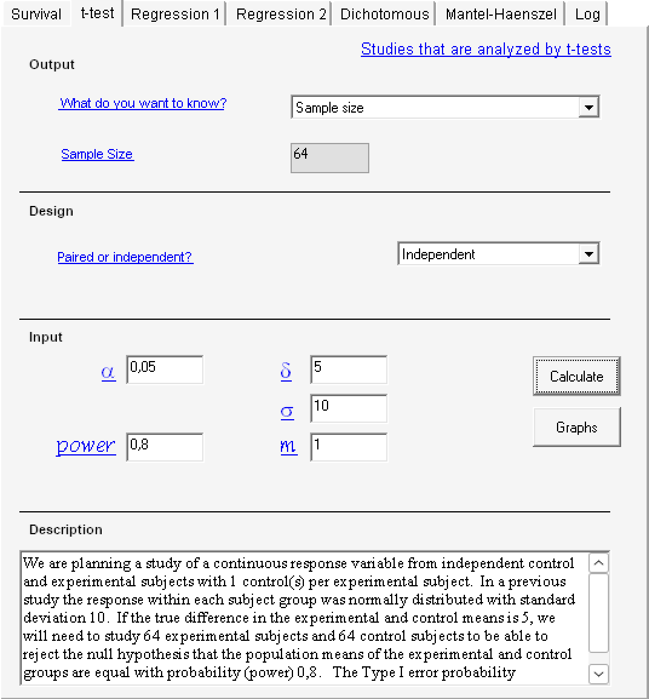

<!--
Članek: https://onlinelibrary.wiley.com/doi/epdf/10.1111/jan.16894
Protokol: https://pmc.ncbi.nlm.nih.gov/articles/PMC9303451/pdf/JAN-78-883.pdf
-->

```{r setup, include=FALSE}
knitr::opts_chunk$set(
	echo = FALSE,
	fig.align = "center",
	fig.pos = "H",
	message = FALSE,
	warning = FALSE,
	results = F, fig.height = 4, fig.width = 5
)

set.seed(2024)
```

# Raziskovalno vprašanje

Samomor je od leta 2009 izziv javnega zdravstva v Južni Koreji, zato so preučili potrebo po razvoju sistema za sprotno spremljanje tveganja za samomor. Raziskava je analizirala 28-dnevni vzorec samomorilnih misli pri psihiatričnih bolnikih z različnim tveganjem za samomor. Glavna vprašanja so bila: opis demografskih in duševnih značilnosti, primerjava vzorcev samomorilnih misli med visokorizičnimi in nizkorizičnimi skupinami ter ugotovitev povezav med samomorilnim razmišljanjem, depresijo, anksioznostjo in stresom skozi čas z metodo EMA (angl. ecological momentary assessment). \
Metoda EMA se v drugih študijah že uporablja za spremljanje nihanja v samomorilskem razmišljanju in dejavnikih, ki na to vplivajo (depresija, anksioznost in stres) in dokazuje, da negativna čustva in prisotnost stresa lahko napovedujejo povečano tveganje za samomorilne misli v kratkem časovnem okviru. Avtorji članka z 28 dnvenim spremljanjem, skupinami in vključevanjem oseb z poskusi samomora rešuje pomanljivosti preteklih raziskav.

# Ciljna populacija

Raziskava vključuje osebe, starejše od 19 let, ki imajo pametni telefon, lahko nosijo napravo za aktigrafijo, govorijo in pišejo korejsko, ter so v zadnjem tednu poročale o samomorilskih mislih ali vedenju, ki so bile merjene z korejsko različico lestvice BSS (angl. Beck Scale for Suicide Ideation) in dosegli rezultat ena ali več. Morajo razumeti namen raziskave, prostovoljno podati soglasje sodelovanja in ne smejo sodelovati v drugi študiji. \
Izključeni so posamezniki z motnjami kognitivnega delovanja (po presoji psihiatra), osebe, stare 65 let ali več, z zmernimi do hudimi kognitivnimi težavami in tisti s psihotičnimi simptomi (npr. halucinacije, blodnje). \
Vzorec ni popolnoma ustrezen za posplošitev na splošno populacijo z samomorilnimi mislimi, saj je omejeno število sodelujočih pri vzorčenju oseb in vsebuje specifičnosti skupin. Zaradi priložnostnega vzorčenja (convenience sampling) se lahko pojavi pristranskost izbire za določeno skupino sodelujočih, saj smo vzorčili osebe, ki so bile na razpolago. Za namen ponovitve rezultatov raziskav, bi morali uporabiti stratificirano ali quoata vzorčenje.

<!-- Kako ustrezen je vzorec? kako nej to vem hah 
Vzorec je izbran za raziskovanje psihiatričnih bolnikov z nedavnimi samomorilnimi mislimi in z določenimi kriteriji. Vendar zaradi majhnosti vzorca in specifičnosti skupine ni popolnoma reprezentativen za celotno populacijo z samomorilnimi mislimi, kar je pomembno upoštevati pri interpretaciji rezultatov.
-->

# Načrt študije
<!--e.	Opišite načrt študije (in kako pomaga odgovoriti na raziskovalno vprašanje)
i.	Preiskovanci
ii.	Spremenljivke (izidi in pojasnjevalne spremenljivke)
iii.	Časovni okvir
iv.	Vrsta študija
-->

<!-- Preisokvanci in vrsta študije
Opazovalna: samo spremljali so stanje bolnikov
Prospektivna: podatke so zbirali v prihodnjem obdobju 28 dni
Longitudinalna: dlje časa
-->
Imamo opazovalno, prospektivno longitudilano študijo, ki je zajemala 50 odraslih oseb, starih od 19 do 58 let, ki so bili bolniki v psihiatrični bolnišnici ali vpisani v National Suicide Prevention Center v Južni Koreji in so imeli nedavne samomorilne misli. Sprva je v študiji sodelovalo 55 oseb, vendar je bilo 5 oseb umaknjenih, zaradi hospitalizacije, težav z nošenjem nosljive naprave, zaposiltve in osebne odločitve. Razdeljeni so bili v dve skupini. Visoko-rizična skupina (n = 40, 80%) je zajemala tiste, ki so imeli poskus samomora v zadnjih tednih, nizko-rizična skupina (n = 10, 20%) pa tiste, ki so imeli samomorilne misli, vendar niso izvedli poskusa samomora. Evidenca poskusov samomora je temeljila na odgovorih udeležencev. \
<!-- Časovni okvir--> 
Vsak od udeležencev je vsaj trikrat na dan v času 20 minut, vsak dan, preko spletne ankete, poročal o svojem razpoloženju, anksioznosti, strestu in samomorilnih mislih, v obdobju 28 dni, nosil zapestno napravo v obdobju 2 tednov (v obdobju 1. in 3. tedna opazovanja) in reševal vprašalnike v obdobju 4 tednov. Podatke so zbirali od maja 2021 do julija 2023.\
<!-- Spremenljivke (izidi in pojasnjevalne spremenljivke) 
to nevem čist, ker v protokolu so neki primary outcoomes pa secondary outocmes...-->
Glavni izid študije je vzorec samomorilskih misli in vzrok psihosocialnega stresa (*izid*). Pojasnili jih bodo preko opisa depresije, anksioznosti in stresa, zdravstvenega stanje, preteklih samomorilskih poskusov, duševnih težav, časa od prve psihiatrične diagnoze ter uporabo zdravil. Zbrani so tudi podatki o starosti, spolu, zakonskem stanju, izobrazbi, socialno-ekonomskem statusu, kajenju, telesni vadbi, spanju ter pridruženih telesnih in duševnih boleznih.

# Statistične metode
<!-- Hipoteza:-->
**Glavna hipoteza:** Vzorci samomorilskih misli so povezani z psihološkimi dejavniki (depresija, anksioznost in stres). \
**Dodatne hipoteze:** Različni psihološki, socialno-demografski in telesni dejavniki vplivajo na intenzivnost samomorilskih misli; obstajajo razlike v vzorcih misli med skupinami z viskim in nizkim rizikom za samomor.\

<!-- Velikost vzorca: 
to se mi kle zdi tok brezveze šeenkrat pisat, ker je že tokrat omenjeno, sam nevem, kaj misls
Tom19: sm se mal dodal pa lahko kr notri pustiva ker ji je ta velikost vzorca zelo pomembna ceprou se se 10x ponovi...-->
Ocenili so, da za primerjavo skupine z visokim in nizkim tveganjem z uporabo t-testa za dva neodvisna vzorca potrebujejo vzorec velikosti vsaj 128 oseb oz. 150 oseb, kjer so upoštevali pričakovano stopnjo izstopov med študijo. Upoštevali so tudi naravo podatkov, saj imajo več meritev na udeleženca.

<!-- Statistične metode za analizo: kle nevem al sm vse napisala al ne, ker je tok tega
Tom19: ja ti je kr vse uspelo sm sel se enkrat vse pocasi cez...-->
Za primerjavo razlik med skupinama z visokim in nizkim tveganjem glede sociodemografskih, zdravstvenih, psihiatričnih in duševnih značilnosti so uporabili neparametrični Wilcoxonov rang-sum test in hi-kvadrat analizo. Za opis EMA odgovorov uporabili deskriptivno statistiko z intraklasnimi korelacijskimi koeficienti (ICC) in korenom srednje kvadratne razlike zaporednih vrednosti (RMSSD), da bi preučili povezanost in spremenljivost posameznih odgovorov. Za identifikacijo razlik v EMA odgovorih med skupinama so uporabili t-test. Učinke trenutne depresije, anksioznosti in stresa na samomorilne misli so preučili z uporabo treh različnih panelnih mešanih (angl. panel mixed-effects) linearnih regresijskih modelov (za posamezno skupino tveganja), v katere so bile vključene različne spremenljivke. Ustreznost modela je bila ocenjena z uporabo ICC in testa verjetnostnega razmerja (LR test). 

# Rezultati in zaključki študije 
<!--g.	Kaj so glavni rezultati? Ali so statistično/klinično pomembni (največ 1 odstavek)-->
Študija kaže in s podatki analize podpira<!--h.	Kako so razprava in zaključki podprti s podatki?-->, da so dnevne spremembe v depresiji, anksioznosti in stresu (psihične težave) močno povezane z intenzivnostjo samomorilnih misli pri psihiatričnih bolnikih s samomorilskimi mislimi in poskusi. Mešani regresijski modeli so pokazali, da povečanje psihičnih težav pomembno napoveduje višjo stopnjo samomorilnih misli v realnem času. 
Med skupinami z visokim in nizkim tveganjem za samomor so zaznali pomembne razlike predvsem pri anksioznosti in stresu. Depresija, anksioznost in stres so bili močno in statistično značilno povezani s samomorilnimi mislimi v obeh skupinah, pri čemer je depresija imela najmočnejši učinek. Visoko tveganje skupina je kazala manj nihanj v razpoloženju. Razlike med skupinami z visokim in nizkim tveganjem so statistično značilne.\
EMA omogoča natančno spremljanje hitrih sprememb v duševnem stanju, kar je ključno za preprečevanje samomora, saj običajni tedenski ali mesečni pregledi lahko spregledajo te hitro spreminjajoče se vzorce. Rezultati kažejo, da bi lahko daljinsko spremljanje in uporaba EMA izboljšala klinične prakse ter omogočila bolj prilagojeno obravnavo bolnikov z visokim tveganjem za samomor.

# Omejitve študije
<!--i.	Ali opazite kakšne omejitve raziskave. -->
Študija je imela več omejitev. Zaradi izvedbe med pandemijo COVID-19, je bilo težko nadzorovati vse vplive in zagotoviti zadostno število udeležencev. Prvotno velikost vzorca 128 so bili zaradi razmer primorani zmanjšati na 50. Študija je bila z bolniki psihiatrične ambulante s samomorilskimi mislimi ali vedenjem, zato ni nujno, da so rezultati posplošljivi. Prav tako se je študija zanašala na samo-poročanje o zgodovini samomorilnih poskusov, brez neodvisne klinične potrditve. Poleg tega so bili v analizo vključeni predvsem psihosocialni stresorji, medtem ko so bili zunanji dejavniki in drugi vplivi spregledani (npr. življenske okoliščinoe, zakonski stan, poklic,...). Zaradi majhnega vzorca in načina vzorčenja obstaja tudi tveganje pristranskosti. 

# Velikost vzorca

<!--a.	Kopirajte odstavek iz dokumenta/protokola, ki opisuje, kako je bila določena velikost vzorca.-->
*Statistical software G- power 3.1 (Faul et al., 2009) will be used to calculate the sample size and compare the low risk of suicide group with the high risk of suicide group using independent t-test. With an effect size of .5, a two-tailed alpha of 0.05 and a power of 80%; a sample size of 128 is required. Considering the dropout rate of 15%, we will recruit at least 150 participants in total. We will recruit the participants who meet the selection criteria through the convenience sampling method from a suicide prevention centre and a psychiatric outpatient clinic in South Korea.*

<!-- Tom24: Se ti zdi da je v vrstici "Predpostavljeno razmerje med skupinama" bilo bolj misljeno kot stevilo oz razmerje da je 1:1 (s tem razmerjem se izide izracun v c) tocki), ceprou ni nikjer to posebej defnirano...
Neza25: a je sploh kje v protokolu definirano kako bi moral delit v skupine oz. kakšno mora bit razmerje? Ker jst ne najdem, samo po čem so jih delil. Sm sprenila v ni utemeljeno... misls da bi mogl bit kako drugac?

in pa da je pol  "Na podlagi zgodovine poskusa samomora" bolj kot spremenljivka/vrednost na podalgi katere delimo stat. enote?
Neza25: ja pomojem, ker tko so jih locl ane, nism vedla kaj nej tuki dam pac kot vrednost ane oz. kako nej to napišem da delil so jih sam nevem v kakšnem razmerju so hotl....-->

```{r, results='asis'}
library(knitr)
library(kableExtra)

tabela <- data.frame(
  kategorija = c(
    "Statistična moč (power)",
    "Stopnja značilnosti",
    "Velikost učinka (effect size)",
    "Načrtovana statistična analiza",
    "Predpostavljeno število udeležencev",
    "Dejanski vzorec",
    "Metoda vzorčenja",
    "Predpostavljena variabilnost",
    "Minimalna klinično pomembna razlika",
    "Predpostavljeno razmerje med skupinama"
  ),
  vsebina = c(
    "80 %",
    "0.05 (dvostranski test)",
    "0.5 (srednje velik učinek)",
    "Neodvisni t-test med visoko- in nizkorizično skupino",
    "128 za zahtevano moč; načrtovanih 150 zaradi 15 % odpadov",
    "50 (zaradi spremenjenega protokola)",
    "convenience sampling",
    "Ni eksplicitno opredeljena",
    "Ni eksplicitno opredeljena",
    "Na podlagi zgodovine poskusa samomora"
  ),
  utemeljitev = c(
    "Navedena (G*Power 3.1, Faul et al., 2009)",
    "Jasno navedena",
    "Navedena, vendar ni dodatno utemeljena",
    "Jasno navedena",
    "Izračun z G*Power; predpostavljena stopnja odpadov",
    # "Spremenjeno zaradi COVID-19; Kim et al. (2022)",
    "Spremenjeno zaradi COVID-19; Kim et al. (2022); ustreznost velikosti utemeljena z (Gutiérrez-Tobal et al. 2022)",
    "Omenjeno, brez statistične utemeljitve",
    "Ni utemeljena",
    "Ni utemeljena",
    "Ni utemeljeno"
  )
)

kable(tabela, format = "latex",
      caption = "Tabela: Predpostavke za določitev velikosti vzorca v raziskavi.",
      col.names = c("Katergorija", "Vrednost", "Utemeljitev")) %>%
  kable_styling(latex_options = c("bordered", "hold_position", "repeat_header"),
                full_width = FALSE, position = "center") %>%
  column_spec(1, width = "4cm") %>%
  column_spec(2, width = "5cm", latex_valign = "m") %>%
  column_spec(3, width = "6cm", latex_valign = "m") %>%
  row_spec(0, bold = TRUE)
```


# Ponovitev izračuna velikosti vzorca

Za ponovni izračun velikosti vzorca, ki ga potrebujemo za primerjavo visoko-rizične in nizko-rizične skupine z neodvisnim t-testom, potrebujemo naslednje vrednosti:

* statistična moč (power): $0.8$
* stopnja značilnosti ($\alpha$): $0.05$
* velikost učinka ($\frac{\delta}{\sigma}$): $0.5$
* predpostavljamo enako veliki skupini ($m=1$)

Velikost učinka (effect size) je definiran kot $d=\frac{\overline{x}_1-\overline{x}_2}{\hat{\sigma}} = \frac{\hat{\delta}}{\hat{\sigma}}$. V našem primeru je vrednost enaka $0.5$, zato si lahko izberemo vrednosti $\frac{\hat{\delta}}{\hat{\sigma}} = \frac{5}{10} = 0.5$. 

Za izračun velikosti vzorca bomo uporabili program PS.

```{r izracun velikosti vzorca, echo=FALSE, fig.cap="Izračun velikosti vzorca s programom PS", results='asis', fig.align = "center", fig.pos = "H",out.width="40%"}

```

Kot rezultat dobimo velikost ene skupine enako $64$, torej je skupna velikost vzorca enaka $2\cdot64=128$, kar je enaka vrednost, kot je zapisana v protokolu raziskave.

 
# Načrt statistične analize in odstopanje od protokola

Načrt statistične analize je dobro opisan v članku in protokolu raziskave. V protokolu lahko najdemo podatke kot so:

* računalniški program, ki se bo uporabljal pri analizah,
* stopnja značilnosti ter informacija o uporabi dvostranskih testov,
* mere, ki jih uporabimo pri opisnih statistikah,
* kateri testi (s specificirano metodo, če je to potrebno) bodo uporabljeni za testiranje posamezne hipoteze.

V članku pa so za posamezno hipotezo, ki jo preverjamo, zapisani tudi testi in koeficienti. Za opis EMA odgovorov je v primerjavi s protokolom dodatno zapisano, da so za preučevenje povezanost in spremenljivost posameznih odgovorov uporabili intraklasni korelacijski koeficient (ICC) in koren srednje kvadratne razlike zaporednih vrednosti (RMSSD). Prav tako so v članku za preučevanje učinkov trenutne depresije, anksioznosti in stresa na samomorilne misli dodatno definirani trije panelni mešani (angl. panel mixed-effects) linearni regresijski modeli z navadenimi spremenljivkami, ki jih vsebujejo.

Odstopanja v uporabi statističnih testov in analizi med protokolom in člankom ni bilo. Pojavilo se je le odstopanje pri velikosti vzorca, saj so bili primorani prvotno velikost vzorca 128 zmanjšatina na 50.


