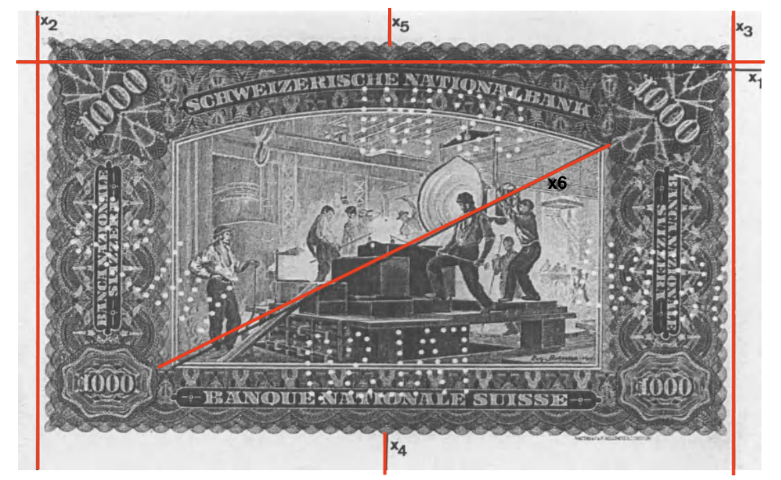

```{r setup, include=FALSE}
knitr::opts_chunk$set(echo = TRUE)
library(cluster)
library(mclust)
set.seed(2020)
```

# Podatki

<!--
Ime raziskave oziroma podatkov. Leto in kraj/država, če je to za podatke
smiselno. Enota analize. Velikost vzorca. Uporabljene spremenljivke (ime v datoteki in
vsebinski pomen). Ostale posebnosti, za katere menite, da so vredne omembe (obravnava
manjkajočih vrednosti, rekodirane spremenljivke ...). Zapišite, katere spremenljivke boste
uporabili za razvrščanje in ali jih boste za ta namen standardizirali.
-->

Uporabila bova podatke _Swiss banknotes data_, ki vsebujejo šest meritev, opravljenih na 100 pravih in 100 ponarejenih starih švicarskih bankovcih za 1000 frankov. 

```{r message=FALSE, warning=FALSE, include=FALSE}
data = read.table("data.txt", header = T, sep = "", dec = ".")
str(data)
nrow(data)
colnames(data)
```


Podatki vsebujejo 7 spremenljivk - 6 številskih in eno opisno. Vsebujejo različne izmerjene dolžine in širine bankovca v milimetrih:

- `length`: dolžina bankovca(na sliki $x_1$), 
- `left`: dolžina levega roba(na sliki $x_2$), 
- `right`: dolžina desnega roba(na sliki $x_3$), 
- `bottom`: dolžina spodnjega roba(na sliki $x_4$) in 
- `top`: dolžina zornjega roba(na sliki $x_5$) ter 
- `diag`: dolžina diagonale bankovca(na sliki $x_6$). 

```{r echo=FALSE, fig.align='center', fig.cap="Označene mere na bankovcu.", fig.show='hold', out.width="70%"}

```

Opisna spremenlivka `status` pa določa ali je bankovec pravi(`genuine`) ali ponarejen(`counterfeit`). V tabeli imamo torej meritve za 200 različnih bankovcev.

## Urejanje podatkov

Imena spremenljivk in vrednosti kategorične spremenljivke sva preimenovala v slovenska imena ter, kot sva že napisala zgoraj, sva podatke skalirala.

Preimenovane spremenljivke:

- `length`: `dolžina`, 
- `left`: `levi.rob`, 
- `right`: `desni.rob`, 
- `bottom`: `spodnji.rob`,
- `top`: `zgornji.rob`, 
- `diag`: `diagonala` in
- `status` : `tip`, kjer je potem `counterfeit`:`ponarejen bankovec` in `genuine`:`pravi bankovec`. 

```{r message=FALSE, warning=FALSE, include=FALSE}
# preimenovanje stolpcev
colnames(data) <- c('dolzina','levi.rob','desni.rob', 'spodnji.rob', 'zgornji.rob', 'diagonala', 'tip')

# nastavim stolpec kot faktor
data$tip <- as.factor(data$tip)
levels(data$tip)
# prevedem v slovenščino
levels(data$tip) <- c("ponarejen bankovec", "pravi bankovec")
levels(data$tip)
```

Za lažjo predstavo si poglejmo opisne statistike številskih spremenljivk, da bomo vedeli s kakšnimi podatki imamo opravka.

```{r echo=FALSE, message=FALSE, warning=FALSE}
library(vtable)
#napovedne spremenljivke
pred <- c('dolzina','levi.rob','desni.rob', 'spodnji.rob', 'zgornji.rob', 'diagonala')
sumtable(data[,pred], add.median = T, digits = 1, 
         title = "Opisne statistike za števillske spremenljivke v podatkovnem okviru \\texttt{Swiss banknotes data}.")
```

Spremenljivke imajo različen razpon vrednosti, zato jih bova, skalirala; vidimo pa tudi, da nimamo mankajočih vrednosti v podatkih.

Poglejmo si še porazdelitve spremenljivk.

```{r echo=FALSE, message=FALSE, warning=FALSE, fig.cap="Porazdelitve spremenljivk v podatkovnem okviru \\texttt{Swiss banknotes data}."}
library(reshape2)
library(ggplot2)
data_long <- melt(data[, c('dolzina','levi.rob','desni.rob', 'spodnji.rob', 'zgornji.rob', 'diagonala', "tip")])

qplot(value, data = data_long, fill=tip, geom = "density", linetype = tip) + 
  facet_wrap(~variable, scales = "free") + 
  theme_bw() + 
  xlab("mm")
```

Opazna je razlika med pravimi bankovci in ponarejenimi pri vseh spremenljivkah.

```{r message=FALSE, warning=FALSE, include=FALSE}
# skaliranje podatkov
# vprasanje: misls da skalirava tud diagonalo k jo uporabva za analizo?, zdej ni skalirana
dfz <- scale(x=data[1:5])
```

Za razvrščanje bova uporabljala samo številske spremenljivke, in sicer `dolzina`, `levi.rob`, `desni.rob`, `spodnji.rob`, `zgornji.rob`; za analizo pa spremenljivki `tip` in `diagonala`. Ker je `diagonala` edina številska spremenljivka pri analizi, le ta ne bo skalirana.

# Hierarhično razvršanje

<!-- Primerjajte tri različne metode (pri vsaki zapišite ime metode in
uporabljeno razdaljo). Uporabite Wardovo metodo s kvadrirano Evklidsko razdaljo in še dve
drugi metodi. Izberite najbolj primerno razvrstitev (metoda in število skupin). Vašo izbiro
utemeljite.
-->

Torej za razvrščanje uporabljava spremenljivke `dolzina`, `levi.rob`, `desni.rob`, `spodnji.rob` in `zgornji.rob` ter primerjala bova tri različne metode in sicer, Wardovo metodo, minimalno metoda (single linkage) in maksimalno metoda (complete linkage).

## Wardowa metoda

```{r}
# matrika razliznosti na standardiziranih podatkih (Evklidska razdalja)
dz <- dist(x=dfz, method="euclidean")

hc.ward <- hclust(d=dz, method="ward.D2")
oldpar <- par(las=1, mfrow=c(1, 3))
barplot(hc.ward$height)
barplot(tail(x=hc.ward$height, n=10), names.arg=rev(seq_len(10)))
plot(hc.ward, labels=F, hang=-1, main="Ward", sub="", xlab="", ylab="")
par(oldpar)
```

## Minimalna metoda 

```{r}
# uporabili smo Evklidsko razdaljo
hc.sin <- hclust(d=dz, method="single")
oldpar <- par(las=1, mfrow=c(1, 3))
barplot(hc.sin$height) 
barplot(tail(x=hc.sin$height, n=10), names.arg=rev(seq_len(10)))
plot(hc.sin, labels=F, hang=-1, main="Single", sub="", xlab="", ylab="")
par(oldpar)
```

## Maksimalna metoda

```{r}
# uporabili smo Evklidsko razdaljo
hc.com <- hclust(d=dz, method="complete")
oldpar <- par(las=1, mfrow=c(1, 3))
barplot(hc.com$height)
barplot(tail(x=hc.com$height, n=10), names.arg=rev(seq_len(10)))
plot(hc.com, labels=F, hang=-1, main="Complete", sub="", xlab="", ylab="")
par(oldpar)
```

## Analiza

Glede na izgled grafov (razvrstitve) sva se odločila, da je najbolj primerna razvrstitev po Wardowi metodi. Pri ostalih dveh metodah so različnosti dokaj majhne (ni tako izrazitih različnosti (višin)). Grafe bomo narisali za _2_, _3_ in _4_ skupine, saj so tu razlike med različnostmi bolj izrazite.

```{r}
# Ward skupine
hc.ward1 <- cutree(tree=hc.ward, k=1)
hc.ward2 <- cutree(tree=hc.ward, k=2)
hc.ward3 <- cutree(tree=hc.ward, k=3)
hc.ward4 <- cutree(tree=hc.ward, k=4)

ime = c('dolzina','levi.rob','desni.rob', 'spodnji.rob', 'zgornji.rob')

oldpar <- par(las=1, mfrow=c(1, 3))
nsk <- 2
sk <- hc.ward2
sk.ime <- paste("sk", 1:nsk, sep="")
agr <- aggregate(x=dfz, by=list(sk), FUN=mean)
y <- t(agr[, -1])
matplot(x=seq_along(ime), y=y, type="o", pch=16, ylim=c(-2, 2), xlab="",
        ylab="Povprecje (standardizirane)")
axis(side=1, at=seq_along(ime), labels=ime, las=2)
legend("bottomleft", legend=sk.ime, col=1:nsk, pch=16)
abline(h=0, v=6.5)
nsk <- 3
sk <- hc.ward3
sk.ime <- paste("sk", 1:nsk, sep="")
agr <- aggregate(x=dfz, by=list(sk), FUN=mean)
y <- t(agr[, -1])
matplot(x=seq_along(ime), y=y, type="o", pch=16, ylim=c(-2, 2), xlab="",
        ylab="Povprezje (standardizirane)")
axis(side=1, at=seq_along(ime), labels=ime, las=2)
legend("bottomleft", legend=sk.ime, col=1:nsk, pch=16)
abline(h=0, v=6.5)
nsk <- 4
sk <- hc.ward4
sk.ime <- paste("sk", 1:nsk, sep="")
agr <- aggregate(x=dfz, by=list(sk), FUN=mean)
y <- t(agr[, -1])
matplot(x=seq_along(ime), y=y, type="o", pch=16, ylim=c(-2, 2), xlab="",
        ylab="Povprezje (standardizirane)")
axis(side=1, at=seq_along(ime), labels=ime, las=2)
legend("bottomleft", legend=sk.ime, col=1:nsk, pch=16)
abline(h=0, v=6.5)
par(oldpar)
```

<!-- Tukej je vrjetno potreben se komentar -->

# Razvrščanje K-means

<!--
Izberite/določite najbolj primerno število skupin. Pomagajte si z
rezultati hierarhičnega razvrščanja in dodatno za metodo K-means narišite grafe:
koleno, pseudo F, gap statistika. Vašo izbiro utemeljite. 
-->

```{r}
# WSS
kmax <- 10
wss <- NULL
for (k in 1:kmax) {
  withinss <- kmeans(x=dfz, centers=k, nstart=100)$tot.withinss
  wss <- c(wss, withinss)
}

# Pseudo F (Calinski and Harabasz index)
pseudoF <- 0
bss <- wss[1] - wss
for (k in 2:kmax) pseudoF <- c(pseudoF, (bss[k]/(k-1)) / (wss[k]/(nrow(dfz)-k)))

# gap statistika
(gap_stat <- clusGap(x=dfz, FUNcluster=kmeans, K.max=kmax))

# grafizni prikaz (vse tri skupaj)
oldpar <- par(las=1, mfrow=c(1, 3))
plot(x=1:kmax, y=wss, type="b", main="WSS", xlab="stevilo skupin",
     ylab="Kriterijska funkcija")
plot(x=1:kmax, y=pseudoF, type="b", main="Pseudo F", xlab="stevilo skupin",
     ylab="Pseudo F")
plot(gap_stat)
par(oldpar)

km1 <- kmeans(x=dfz, centers=1, nstart=1)
km2 <- kmeans(x=dfz, centers=2, nstart=100)
km3 <- kmeans(x=dfz, centers=3, nstart=100)
km4 <- kmeans(x=dfz, centers=4, nstart=100)
```

Število skupin glede na posamezni graf:

* WSS: sprememba naklona izgleda največja pri **4** skupinah
* Pseudo F: maksimum doseze pri **2** skupinah
* gap statistika: najvišjo točko preden začne padati doseže pri **4** skupinah

Do podobnih ugotovitev smo prišli s pomočjo rezultatov hierarhičnega razvrščanja. Tam smo se odločali med 2, 3 ali 4 skupinami. Vendar pa težimo k večjemu številu skupin kot le 2. 

Torej glede na analizo, ki smo jo naredili do sedaj so **4** najbolj primeren rezultat.

<!--
Primerjajte vrednost kriterijske funkcije pri različnem številu skupin za Wardovo
metodo in K-means. Katera metoda je boljša? Pri izbranem številu skupin primerjajte
obe razvrstitvi. Izpišite kontingenčno tabelo in izračunajte popravljen Randov indeks.
-->

```{r}
# Wardova kriterijska funkcija
WardKF <- function(data, cluster){
  # vsota kvadratov
  # x = ena spremenljivka
  ss <- function(x) sum((x-mean(x))^2)
  # vsota kvadratov znotraj ene skupine po vseh spremenljivkah
  # X = matrika, stolpci so spremenljivke
  withinss <- function(X) sum(apply(X=X, MARGIN=2, FUN=ss))
  # vsota kvadratov vseh skupin
  sum(by(data=data, INDICES=cluster, FUN=withinss))
}

wkf <- NULL
wkf <- rbind(wkf, c(WardKF(dfz, hc.ward1), WardKF(dfz, hc.ward2), WardKF(dfz, hc.ward3), WardKF(dfz, hc.ward4)))
wkf <- rbind(wkf, c(WardKF(dfz, km1$cluster), WardKF(dfz, km2$cluster), WardKF(dfz, km3$cluster), WardKF(dfz, km4$cluster)))
rownames(wkf) <- c("Ward", "Kmeans")
colnames(wkf) <- c("k=1", "k=2", "k=3", "k=4")
wkf
```

Vidimo da ima v vseh primerih (z izjemo prvega kjer sta enaka) K-means manjšo vrednost, kar tudi želimo. Primerjavo razvrtitev bomo naredili na številu skupin **4**. 

```{r}
# kontingenčna tabela
table(km4$cluster, c(3, 2, 4, 1)[hc.ward4])

# popravljen Randov indeks
adjustedRandIndex(x=km4$cluster, y=hc.ward4)
```

<!-- Tukej nevem kaj bi komentiral -->

#  Razvrščanje na podlagi modelov

<!-- Ali je porazdelitev spremenljivk primerna za uporabo te metode? Ne glede na
primernost uporabite metodo za razvrščanje na vaših podatkih. Izberite najbolj
primeren model in število skupin. Izbiro utemeljite.
-->

Metoda predpostavlja multivariatno normalno porazdelitev zato si poglejmo
porazdelitev spremenljivk

```{r}
oldpar <- par(las=1, mfrow=c(2, 3))
for (i in seq_along(ime)) {
  hist(data[, ime[i]],
       main=ime[i],
       xlab="",
       ylab="Frekvenca")
}
par(oldpar)
```

Nekatere spremenljivke niso porazdeljene po normalni porazdelitvi, zato ne moremo trditi da je zadoščen pogoj. 

```{r}
(mc <- Mclust(data=dfz, G=1:5))
summary(mc)

plot(x=mc, what="BIC")
```

Najbolj primeren model je VEE (vsi elipticne oblike, razlicnih velikosti in enake orientacije) in 3 skupine. 