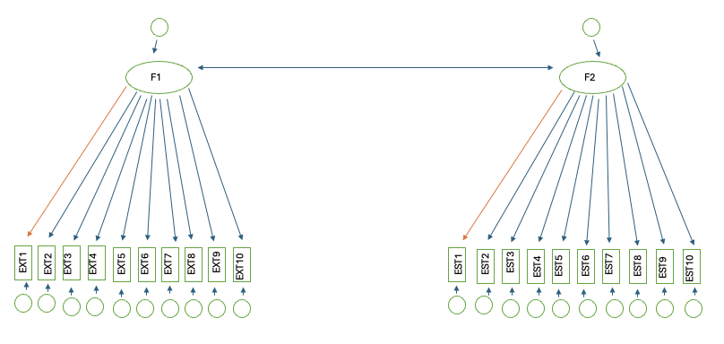
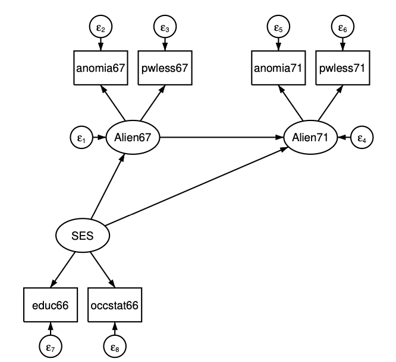

<!--Neza10: bi lahko prosim dal v mapo sliko model1, da lahko nardim pdf, zdej je zakomentirano-->

```{r setup, include=FALSE}
knitr::opts_chunk$set(
	echo = FALSE,
	fig.align = "center",
	fig.pos = "H",
	message = FALSE,
	warning = FALSE,
	results = F, fig.height = 4, fig.width = 5
)

library(haven)
library(psych)
library(ggplot2)
library(reshape2)
library(dplyr)
library(kableExtra)
library(blockmodeling)
library(foreign)
library(psych)
library(lavaan)
library(corrplot)
library(gridExtra)

set.seed(2024)
```

\tableofcontents
\listoffigures
\listoftables
\newpage

# Podatki - konfirmatorna faktorska analiza in merska enakovrednost(MG-CFA)

```{r}
# vsi podatki
dataframe <- read_sav("dn3_big5.sav") 

# samo najni stolpci
stolpci = c("EXT1","EXT2","EXT3","EXT4","EXT5","EXT6","EXT7","EXT8","EXT9","EXT10",
            "EST1","EST2","EST3","EST4","EST5","EST6","EST7","EST8","EST9","EST10", "country")

# najni podatki
podatki1 = dataframe[dataframe$country == "FR", stolpci]
podatki2 = dataframe[dataframe$country == "IT", stolpci]
podatki = rbind(podatki1, podatki2)
n_prej = nrow(podatki) # stevilo vrstic pred odstranitvijo NA
podatki = na.omit(podatki) # odstranjene vrstice, ki vsebujejo NA
razlika = n_prej - nrow(podatki) # stevilo odtrajenih vrstic

# po drzavah
n_prej_fr = nrow(podatki1)
n_prej_it = nrow(podatki2)
podatki1 = na.omit(podatki1)
podatki2 = na.omit(podatki2)
razlika_fr = n_prej_fr - nrow(podatki1)
razlika_it = n_prej_it - nrow(podatki2)
```

<!-- 
https://www.kaggle.com/datasets/tunguz/big-five-personality-test/data
-->

V nalogi obravnavava konfirmatorno faktorsko analizo(CFA) in mersko enakovrednost(MG-CFA) na podatkih testa osebnosti za državo Francija ter Italija in spremenljivke, ki so kodirane z "EXT1-10" in "EST1-10".

**Energija (ektravertnost, surgentnost)**

* EXT1...Sem zabavna oseba, ki je rada v središču dogajanja (+)
* EXT2...Ne govorim veliko (-)
* EXT3...Dobro se počutim v krogu ljudi (+)
* EXT4...Raje sem v ozadju (stran od pozornosti/neopazen) (-)
* EXT5...Jaz začenjam pogovore (+)
* EXT6...Nimam veliko za povedati/Sem redkobeseden (-)
* EXT7...Na zabavah se pogovarjam z veliko različnimi osebami (+)
* EXT8...Ne maram pritegniti pozornosti ostalih (-)
* EXT9...Ne moti me če sem v središču dogajanja (+)
* EXT10...V okolici neznancev ne govorim (-)

**Čustvena stabilnost (nevroticizem)**

* EST1...Hitro postanem živčen (-)
* EST2...Večino časa sem sproščen (+)
* EST3...Skrbi me za veliko stvari (-)
* EST4...Redko sem žalosten, melanholičen, emotično pretresen (+)
* EST5...Stvari me hitro zmotijo (-)
* EST6...Hitro se razjezim (-)
* EST7...Dosti spreminjam razpoloženje (-)
* EST8...Imam pogosta nihanja razpoloženja (-)
* EST9...Sem hitro vzkipljiv (-)
* EST10...Pogosto se počutim žalostno, melanholično, emotično pretreseno (-)

Vrednosti trditev, ki so označene z (-) bomo množili z $-1$ in s tem obrnili lestvico.

```{r}
negativne = c("EXT2", "EXT4", "EXT6", "EXT8", "EXT10",
              "EST1", "EST3", "EST5", "EST6", "EST7", "EST8", "EST9", "EST10")

# negativne = c("EXT2", "EXT4", "EXT6", "EXT8", "EXT10",
#               "EST2", "EST4")

for(el in negativne){
  podatki[[el]] = -1*podatki[[el]]
}

```

Iz podatkovnega okvirja sva odstranila vrstice, ki so vsebovale kakšno _NA_ vrednost. Takih vrstic je bilo `r razlika`, torej imava na koncu `r nrow(podatki)` podatkov - pri državi Francija je bilo mankajočih podatkov `r razlika_fr`, torej je bilo za Francijo uporabnih `r nrow(podatki1)`, pri državi Italija pa je bilo mankajočih podatkov `r razlika_it`, torej je bilo za Italijo uporabnih `r nrow(podatki2)`.

Poglejmo si nekatere opisne statistike sklopa spremenljivk pri _energiji_ in sklopa spremenljivk  _čustvene stabilnosti_. V spodnjih tabelah vidimo, da so podatki v redu in nimamo nepravilnih vrednosti, ki niso znotraj lestvice.

```{r, results=T}
stat.fr = data.frame(spremenljivke = c("EXT1", "EXT2", "EXT3", "EXT4", "EXT5", "EXT6", "EXT7", "EXT8", "EXT9", "EXT10", "EST1", "EST2", "EST3", "EST4", "EST5", "EST6", "EST7", "EST8", "EST9", "EST10"),
           mean = c(2.48,-2.972,3.055,-3.242,3.118,-2.469, 2.679 ,-3.414 ,2.944,-3.688 ,-3.325
                    ,3.061,-3.862,2.804,-3.182,-2.913,-3.107,-2.884,-3.015,-3.122),
           Min = c(1.000,-5.000,1.000,-5.000,1.000,-5.000,1.000,-5.000,1.000,-5.000,-5.000,1.000,
                   -5.000,1.000,-5.000,-5.000,-5.000,-5.000, -5.000, -5.000), 
           Max = c(5.000,-1.000,5.000,-1.000,5.000,-1.000 ,5.000,-1.000,5.000,-1.000,-1.000,5.000,
                   -1.000,5.000,-1.000,-1.000,-1.000,-1.000,-1.000,-1.000))

kable(stat.fr, 
      caption="Opisne statistike za števillske spremenljivke v podatkovnem okviru za državo Francija.") %>% 
  kable_styling(full_width=F, latex_options="hold_position")

stat.it = data.frame(spremenljivke = c("EXT1", "EXT2", "EXT3", "EXT4", "EXT5", "EXT6", "EXT7", "EXT8", "EXT9", "EXT10", "EST1", "EST2", "EST3", "EST4", "EST5", "EST6", "EST7", "EST8", "EST9", "EST10"),
           mean = c(2.457, 2.955, 3.014, 3.233, 3.106, 2.377,  2.564, 3.336, 2.994, 3.696, 3.309,
                     2.794, 3.888, 2.8, 3.054, 3.034, 3.288, 3.016,  3.079, 3.076),
           Min = c( 1.000, 1.000, 1.000, 1.000, 1.000, 1.000,  1.000, 1.000, 1.000, 1.000, 1.000,
                    1.000,  1.000, 1.0, 1.000, 1.000, 1.000, 1.000,  1.000, 1.000), 
           Max = c(5.000, 5.000, 5.000, 5.000, 5.000, 5.000,  5.000, 5.000, 5.000, 5.000, 5.000,
                    5.000,  5.000, 5.0, 5.000, 5.000, 5.000, 5.000,  5.000, 5.000))

kable(stat.it, 
      caption="Opisne statistike za števillske spremenljivke v podatkovnem okviru za državo Italija.") %>% 
  kable_styling(full_width=F, latex_options="hold_position")
```
\newpage

# Konfirmatorna faktorska analiza(CFA)
<!--Tom29: sm dodal zdej na konec tega razdelka...
Tom25: tole nevem se sm kje zasledil pa nocem kr nekam vrint da te ne pokvarim izgleda

"Kolikšno je število poznanih vrednosti v kovariančni matriki (število informacij)? Kolikšno je število ocenjenih parametrov v modelu? Kolikšno je število prostostnih stopenj?"

20*(20+1)/2 - (10+9+1+10+9+1+1) = 169

20*(20+1)/2 pride iz kovariancne matrike kjer prestejes st. elementov na diagonali in pod diagonalo (midva imava 20 elementov EXT1-10 in EST1-10)

(10+9+1+10+9+1+1) pa stevilo parametrov k jih ocenjujemo 

10 ... st. varianc oz nepojasnjenih delov pri EST1-10 
9 ... st. vezi med ESTxx in f1 (vezi je sicer 10 vedar eno fiksiramo na 1)
1 ... nepojasnjen del pri f1

10 ... st. varianc oz nepojasnjenih delov pri EXT1-10 
9 ... st. vezi med EXTxx in f1 (vezi je sicer 10 vedar eno fiksiramo na 1)
1 ... nepojasnjen del pri f1

1 ... povezava med f1 in f2

In se stevilke tud ujemaj s summary(cfa.fit,...)
Ce pa slucajno ze imava pa da sm spregledal pa sami izbrisi :)
-->

Analizo izvajamo na zgoraj opisanih podatkih za državo Francija. Predpostavimo večrazsežno normalno porazdelitev spremenljivk - kar lahko približno vidimo na spodnjih grafih glede na sklop in državo, primernost merskih lestvic in ustrezno velikost vzorca. 

<!-- Neza10: to je zdej vsak hist posebi narisan, nevem kako nej nardim da se jih bo vec izrisal v eni vrsti ker neki jamra da je preveliko...
-->

```{r echo=FALSE, fig.cap="Porazdelitev spremenljivk v sklopih energija in čustvena stabilnost za državo Francija.", fig.dim=c(8,8)}
# francija_energija = podatki[podatki$country == "FR", 1:10]
# italija_energija = podatki[podatki$country == "IT", 1:10]
# francija_custvenastab = podatki[podatki$country == "FR", 11:20]
# italija_custvenastab = podatki[podatki$country == "IT", 11:20]

# oldpar <- par(mfrow=c(2, 2))
# hist(unlist(francija_energija), main="Energija - FR", ylab="frekvenca", xlab="")
# hist(unlist(francija_custvenastab), main="Custvena stabilnost - FR", ylab="frekvenca", xlab="")
# hist(unlist(italija_energija), main="Energija - IT", ylab="frekvenca", xlab="")
# hist(unlist(italija_custvenastab), main="Custvena stabilnost - IT", ylab="frekvenca",xlab="")
# par(oldpar)

g1 = ggplot(podatki1, aes(x=EXT1))+geom_histogram(binwidth=1)+xlab("")+ylab("frekvenca")+ggtitle("EXT1")+theme_bw()
g2 = ggplot(podatki1, aes(x=EXT2))+geom_histogram(binwidth=1)+xlab("")+ylab("frekvenca")+ggtitle("EXT2")+theme_bw()
g3 = ggplot(podatki1, aes(x=EXT3))+geom_histogram(binwidth=1)+xlab("")+ylab("frekvenca")+ggtitle("EXT3")+theme_bw()
g4 = ggplot(podatki1, aes(x=EXT4))+geom_histogram(binwidth=1)+xlab("")+ylab("frekvenca")+ggtitle("EXT4")+theme_bw()
g5 = ggplot(podatki1, aes(x=EXT5))+geom_histogram(binwidth=1)+xlab("")+ylab("frekvenca")+ggtitle("EXT5")+theme_bw()
g6 = ggplot(podatki1, aes(x=EXT6))+geom_histogram(binwidth=1)+xlab("")+ylab("frekvenca")+ggtitle("EXT6")+theme_bw()
g7 = ggplot(podatki1, aes(x=EXT7))+geom_histogram(binwidth=1)+xlab("")+ylab("frekvenca")+ggtitle("EXT7")+theme_bw()
g8 = ggplot(podatki1, aes(x=EXT8))+geom_histogram(binwidth=1)+xlab("")+ylab("frekvenca")+ggtitle("EXT8")+theme_bw()
g9 = ggplot(podatki1, aes(x=EXT9))+geom_histogram(binwidth=1)+xlab("")+ylab("frekvenca")+ggtitle("EXT9")+theme_bw()
g10 = ggplot(podatki1, aes(x=EXT10))+geom_histogram(binwidth=1)+xlab("")+ylab("frekvenca")+ggtitle("EXT10")+theme_bw()
#grid.arrange(g1,g2,g3,g4,g5,g6,g7,g8,g9,g10,ncol = 3)

g11 = ggplot(podatki1, aes(x=EST1))+geom_histogram(binwidth=1)+xlab("")+ylab("frekvenca")+ggtitle("EST1")+theme_bw()
g12 = ggplot(podatki1, aes(x=EST2))+geom_histogram(binwidth=1)+xlab("")+ylab("frekvenca")+ggtitle("EST2")+theme_bw()
g13 = ggplot(podatki1, aes(x=EST3))+geom_histogram(binwidth=1)+xlab("")+ylab("frekvenca")+ggtitle("EST3")+theme_bw()
g14 = ggplot(podatki1, aes(x=EST4))+geom_histogram(binwidth=1)+xlab("")+ylab("frekvenca")+ggtitle("EST4")+theme_bw()
g15 = ggplot(podatki1, aes(x=EST5))+geom_histogram(binwidth=1)+xlab("")+ylab("frekvenca")+ggtitle("EST5")+theme_bw()
g16 = ggplot(podatki1, aes(x=EST6))+geom_histogram(binwidth=1)+xlab("")+ylab("frekvenca")+ggtitle("EST6")+theme_bw()
g17 = ggplot(podatki1, aes(x=EST7))+geom_histogram(binwidth=1)+xlab("")+ylab("frekvenca")+ggtitle("EST7")+theme_bw()
g18 = ggplot(podatki1, aes(x=EST8))+geom_histogram(binwidth=1)+xlab("")+ylab("frekvenca")+ggtitle("EST8")+theme_bw()
g19 = ggplot(podatki1, aes(x=EST9))+geom_histogram(binwidth=1)+xlab("")+ylab("frekvenca")+ggtitle("EST9")+theme_bw()
g20 = ggplot(podatki1, aes(x=EST10))+geom_histogram(binwidth=1)+xlab("")+ylab("frekvenca")+ggtitle("EST10")+theme_bw()
grid.arrange(g1,g2,g3,g4,g5,g6,g7,g8,g9,g10,g11,g12,g13,g14,g15,g16,g17,g18,g19,g20,
             ncol = 4)
```

Iz zgornjih grafov vidimo, da porazdelitve odstopajo od normalne porazdelitve. Opaziti je asimetričnost v desno oziroma porazdelitev z dvema vrhovoma.

## Grafični prikaz modela

```{r, fig.cap="Shema modela.", results=T}
#
```

**Število prostostnih stopenj**

V variančno-kovariančni matriki imamo 20 spremenljivk (EXT1-10 in EST1-10). Vrednosti pod in nad diagonalo so enake zato se lahko omejimo samo na diagonalo in vrednosti, ki so pod njo. Torej število poznanih vrednosti (število informacij) je $\frac{20*(20+1)}{2}=210$. \
Število parametrov, ki jih ocenjujemo v modelu je enako $41$.

* število nepojasnjenih delov v modelu je enako $10+10+1+1=22$ (EXT1-10: 10, EST1-10: 10, F1: 1, F2: 1).
* pri vsakem faktorju eno izmed povezav fiksiramo na 1, ostalih 9 pa ocenjujemo. Ker imamo dva faktorja v tem primeru ocenjujemo $9+9=18$ parametrov.
* povezanost med faktorjema prispeva en parameter

Torej če seštejemo zgornje vrednosti $22+18+1=41$.

Število prostostnih stopenj je enako $210-41=169$, kar je tudi vrednost, ki nam jo vrne program.

## Model

Najprej naredimo model na nestandardiziranih spremenljivkah in pogledajmo kako dobro se prilega podatkom. Kot latentne spremenljivke sva izbrala energijo(sklop spremenljivk "EXT1-10") in čustveno stabilnost(sklop spremenljivk "EST1-10").

```{r}
podatki.fr = podatki[podatki$country == "FR", 1:20]
```

```{r echo=TRUE}
# CFA
# zapis modela
cfa.model <- "
	# latentne spremenljivke
	  f1 =~ EXT1 + EXT2 + EXT3 + EXT4 + EXT5 + EXT6 + EXT7 + EXT8 + EXT9 + EXT10
	  f2 =~ EST1 + EST2 + EST3 + EST4 + EST5 + EST6 + EST7 + EST8 + EST9 + EST10
	"

# analiza
cfa.fit <- cfa(model=cfa.model, data=podatki.fr, estimator="MLR")
```

Zavrnemo ničelno domnevo($p = 0.000$), da je variančno-kovariančna matrika ocenjena na podlagi modela enaka populacijski, kar ni v redu. Zavedamo se, da imamo velik vzorec in $\chi^2$ (kar uporabljamo pri tej analizi) je občutljiv na velike vzorce in hitro zavrača ničelno domnevo. 

Poglejmo si odstopanja, kjer si želimo, da so elementi izven diagonale čim bližje 0, kar lahko vidimo, da po večini ustreza, z izjemo parih, ki imajo pozitivne odklone.
<!--Neza10: tega pa ne znam komentirat, ker na vajah nismo komentiral druzga kokr to da morjo bit čim bližje 0-->

```{r, fig.cap="Grafični prikaz odklonov."}
razlika <- residuals(object=cfa.fit, type="cor")$cov
int <- c(-1, -0.2, 0.2, 1)
nint <- length(int) - 1
legint <- c("neg", "zanemarljivo", "poz")
heatmap(x=razlika, Rowv=NA, symm=T, revC=T, margins=c(15, 15), col=hcl.colors(n=nint, palette="Blue-Red 3", rev=T), breaks=int)
legend(x="topleft", legend=legint, fill=hcl.colors(n=nint, palette="Blue-Red 3", rev=T), inset=c(0.75, 0), xpd=T)
```

```{r}
summary(cfa.fit, fit=T, rsquare=T, standardized=T) # celotna resitev
# indeksi prileganja
fitMeasures(cfa.fit, fit.measures = c("rmsea", "srmr", "cfi", "tli"))
```

Strmimo k temu, da je User Model statistično neznačilen, kar ni ($p = 0.000$) v najinem primeru, Baseline Model pa statistično značilen, čemur pa najin model ustreza. Z modela tudi razbereva, da imava med faktorjema $f_1$(energija) in $f_2$(čustvena stabilnost) kovarianco.

RMSEA, ki nam pove v kolikšni meri se model dobro prilega vrednostim na populaciji, vrne vrednost 0.093, kar sicer je pod 0.1(želimo si pod 0.06), in je model mejno sprejemljiv. 

SRMR, ki meri koren povprečne kvadrirane razlike med ocenjenimi in modelskimi korelacijemi, vrne vrednost 0.065, kar je manj od mejne vrednosti 0.08.

CFI, kateri primerja ocenjen model z modelom brez korelacij zavzame vrednost 0.833, kar je pod najnižjo mejno vrednostjo 0.90(želimo si, da je nad 0.95), prav tako je TLI vrednost 0.812, ki je podobna CLI in je pod skrajno mejno vrednostjo 0.90(želimo si, da je nad 0.95).

Na podlagi mere prileganja bi rekla, da model ni sprejemljiv in se ne prilega najbolje podatkom in to, da smo zgoraj zavrnili ničeno domnevo ni v redu.

## Spremembe modela

Poglejmo ali modelu lahko dodamo spremembe, ki bi dodatno pripomogle k ustreznosti modela ter prileganju podatkom. 

```{r echo=TRUE}
# spremembe modela - ker model očitno ni najboljši, 
# ga popravimo s funkcijo, ki predlaga spremembe
modindices(object=cfa.fit, sort=T, maximum.number=10) 

# popravljanje modela - spremenljivke sva dodajala postopoma
cfa.model1 <- "
  f1 =~ EXT1 + EXT2 + EXT3 + EXT4 + EXT5 + EXT6 + EXT7 + EXT8 + EXT9 + EXT10
  f2 =~ EST1 + EST2 + EST3 + EST4 + EST5 + EST6 + EST7 + EST8 + EST9 + EST1
	# sproscene omejitve
	EST7 ~~ EST8
	EST6 ~~	EST9
	EST1 ~~	EST2
	EST1 ~~	EST3
	EXT8 ~~	EXT9 # se ne izbolšuje več od tu naprej
	# EST1 ~~	EST8
	# EST1 ~~	EST7
"
cfa.fit <- cfa(model=cfa.model1, data=podatki.fr, estimator="MLR")

# indeksi prileganja
indeksi.prileganja = fitMeasures(cfa.fit, fit.measures = c("rmsea", "srmr", "cfi", "tli"))
povzetek = summary(cfa.fit, fit=T, rsquare=T, standardized=T)
```

RMSEA je tokrat 0.056, kar je pod 0.06, in je na podlagi tega model (mejno) sprejemljiv. SRMR je sedaj 0.047. CFI in TLI pa še vedno nista nad 0.95, ampak sta nad 0.9, TLI ima vrednost 0.934, CFI pa 0.944. Na podlagi mere prileganja bi rekla, da model sedaj je sprejemljiv in se prilega podatkom. 

Na podlagi Model Test User Model($p < 0.001$), katerega vrednost testne statistike, pri 146 stopinjah prostosti, je enaka 2379.941, pri stopnji značilnosti $0.05$ zavrnemo domnevo, da je variančno-kovariančna matrika ocenjena na podlagi modela enaka populacijski in sprejmemo domnevo, da se statistično značilno razlikujeta.

Na podlagi Model Test Baseline Model($p < 0.001$) tudi zavrnemo ničelno domnevo pri stopnji statistične značilnosti 0.05, da je variančno-kovariančna matrika ocenjenega modela enaka variančno-kovariančni matriki začetnega modela(brez korelacije spremenljivk).

Testa sta sicer izredno občutljiva in se le redko zgodi, da ničelnih domnev ne zavračamo, torej željeno bomo težko dobili, zato se z rezultatom ne obremenjujeva.

Da zagotoviva identifikabilnost modela, sva pri vsakem faktorju eni spremenljivki vrednost faktorske uteži nastavila na 1 (marker indikator). Pri faktorju energija je to indikator EXT1 in pri čustveni stabilnosti je to EST1.

Vrednosti p so pri vseh spremenljivkah manjše od 0.001, torej so vrednosti ocenjenih koeficientov statistično značilno različne od 0. Iz ocen standariziranih koeficientov sva razbrala, da imata največji vpliv na energijo EXT5 in EXT7, na čustveno stabilnost pa EST1 in EST6. Vrednosti vseh koeficientov so pozitivne, torej se s povečanjem vrednosti spremenljivk, poveča tudi vrednost latentne.

Poglejmo si še korelacije med latentnimi spremenljivkami. Vse korelacije so pri stopnji značilnosti 0.05 statistično značilne($p < 0.001$). Vse korelacije so pozitivne, kar pomeni, da se s povečanjem vrednosti ene spremenljivke, poveča tudi vrednost druge, npr. bolj kot imajo ljudje nihanje razpoloženja(EST8) bolj spreminjajo razpoloženje(EST7) ali manj kot ljudi skrbi za veliko stvari(EST3) in več kot so sproščeni(EST2) kasneje postanejo živčni(EST1).

# Merska enakovrednost Francije in Italije(MG-CFA)

Zanima naju, ali pri različnih pogojih opazovanja in raziskovanja, kar izhaja iz različnih skupin, meritve še vedno merijo isto lastnost in do kakšne mere so naši rezultati primerljivi med skupinami. V našem primeru skupine določajo države in obravnavani državi sta Francija in Italija. 

Za model vzameva zadnji popravljeni model za državo Francija, torej zadnji najboljši.

```{r}
# zadnji najboljsi model
cfa.model1 <- "
  f1 =~ EXT1 + EXT2 + EXT3 + EXT4 + EXT5 + EXT6 + EXT7 + EXT8 + EXT9 + EXT10
  f2 =~ EST1 + EST2 + EST3 + EST4 + EST5 + EST6 + EST7 + EST8 + EST9 + EST1
	# sproscene omejitve
	EST7 ~~ EST8
	EST6 ~~	EST9
	EST1 ~~	EST2
	EST1 ~~	EST3
	EXT8 ~~	EXT9 # se ne izbolšuje več od tu naprej
	# EST1 ~~	EST8
	# EST1 ~~	EST7
"
```

## Konfiguralna merska enakovrednost

Konfiguralna enakovrednost nastopi, ko so v vseh skupinah merjeni enaki koncepti in so med skupinami identične faktorske strukture. V vseh skupinah imamo iste spremenljivke za merjenje izbranih latentnih spremenljivk. 

```{r echo=TRUE}
configural.fit <- cfa(model=cfa.model1, data=podatki, group="country", estimator="MLR") 
```

```{r}
fitMeasures(configural.fit, fit.measures= c("rmsea", "srmr", "cfi", "tli"))
povzetek = summary(configural.fit, fit=T, rsquare=T, standardized=T)
```

RMSEA je 0.056, kar je pod 0.06, in je na podlagi tega model sprejemljiv. SRMR je sedaj 0.046. CFI in TLI pa nista nad 0.95, ampak sta nad 0.9, TLI ima vrednost 0.932, CFI pa 0.942. Na podlagi mere prileganja bi rekla, da model je sprejemljiv in se prilega podatkom, torej bi lahko isti model uporabili na obeh državah.

## Metrična merska enakovrednost

Pri metrični enakovrednosti ima povečanje latentne spremenljivke za eno enoto enak pomen v vseh skupinah, torej so faktorske uteži med skupinami enake, kar nam omogoča testiranje razlik v moči vplivov med različnimi skupinami. 

```{r echo=TRUE}
loadings.fit <- cfa(model=cfa.model1, data=podatki, 
                    group="country", group.equal="loadings", estimator="MLR")
```

```{r}
fitMeasures(loadings.fit, fit.measures= c("rmsea", "srmr", "cfi", "tli"))
```

RMSEA je 0.057, kar je pod 0.06 in je na podlagi tega model sprejemljiv. SRMR je sedaj 0.052, kar je manj od 0.08. CFI in TLI pa nista nad 0.95, TLI ima vrednost 0.938, CFI pa 0.932. Pričakujemo sicer slabše prileganje modela, saj fiksiramo faktorske uteži, ampak na podlagi mer prileganja bi rekla, da model je sprejemljiv in se prilega podatkom, torej uteži med Francijo in Italijo sta enaki in imamo omogočeno primerjavo regresijskih koeficientov.

## Skalarna merska enakovrednost

Imamo jo v primeru polne primerljivosti vseh vrednosti, torej ko so tako regresijski koeficienti in konstante kot faktorske uteži med državama enake. Omogoča pa nam primerljivost povprečij.

```{r echo=TRUE}
intercepts.fit <- cfa(model=cfa.model1, data=podatki, group="country", 
                      group.equal=c("loadings", "intercepts"), estimator="MLR")
```

```{r}
fitMeasures(intercepts.fit, fit.measures= c("rmsea", "srmr", "cfi", "tli"))
```


Tudi tukaj sta meri RMSEA in SRMR v sprejemljivem območju, CFI in TLI pa sta nad 0.9(RMSEA = 0.057, SRMR = 0.053, TLI = 0.930, CFI = 0.934)) in je prileganje modela sprejemljivo.

Predpostavimo torej, da imamo med Italijo in Francijo metrično, konfiguralno in skalarno enakovrednost in tako lahko testiramo razlike v moči vplivov med državama in primerjamo povprečja.

Naredimo še primerjavo modelov s testom `anova`.

```{r echo=TRUE, results=T}
# primerjava modelov
anova(configural.fit, loadings.fit, intercepts.fit)
```

Torej če modele primerjamo po Akaikijevem informacijskem kriteriju, vidimo, da je konfiguralna merska enakovrednost najboljša, saj ima najnižjo AIC vrednost.

# Analiza mediacije z latentnimi spremenljivkami (SEM)

```{r}
data <- read.csv("dn4_stata_sem_ex9.csv", header=T)

povprecja = data[1,]
standardni_odkloni = data[2,]
korelacijska_matrika = data[3:nrow(data),]

potrebni = c("educ66","occstat66","anomia67", "pwless67", "anomia71", "pwless71")
indeksi = which(colnames(korelacijska_matrika) %in% potrebni)

kovariancna_matrika = diag(standardni_odkloni) %*% as.matrix(korelacijska_matrika) %*% diag(standardni_odkloni)

kovariancna_matrika = kovariancna_matrika[indeksi,indeksi]

rownames(kovariancna_matrika) = potrebni
colnames(kovariancna_matrika) = potrebni
```

## Podatki

Raziskava je bila zasnovana kot zbiranje vrednosti spremenljivk v letih 1966, 1967, 1971 v dveh regijah. Prva regija je bilo območje kjer je bil zgrajen Jones & Laughlin jeklena industrija, in testno območje kjer ni bilo takega razvoja. V celoti so zbrali podatke za 932 enot. 

```{r results=TRUE}

predstavitev_data = data.frame("spremenljivka" = c("educ66", "occstat66", "anomia66","pwless66","socdist66","occstat67","anomia67", "pwless67", "socdist67", "occstat71", "anomia71", "pwless71", "socdist71"),
                               "pomen" = c("Education, 1966", "Occupational status, 1966", "Anomia, 1966", "Powerlessness, 1966", "Latin American social distance, 1966", "Occupational status, 1967", "Anomia, 1967", "Powerlessness, 1967", "Latin American social distance, 1967", "Occupational status, 1971", "Anomia, 1971", "Powerlessness, 1971", "Latin American social distance, 1971"))

kable(predstavitev_data, 
      caption="Predstavitev podatkov.") %>% 
  kable_styling(full_width=F, latex_options="hold_position")
```

Poglejmo si še prikaz korelacijske matrike spremenljivk, del katere bomo kasneje tudi uporabili.

```{r fig.dim=c(5,5), fig.cap="Korelacija med spremenljivkami."}
colors10 <- colorRampPalette(c("#0000aa","white","#aa0000"))(10)
corrplot.mixed(as.matrix(korelacijska_matrika),
               lower.col = colors10, upper.col = colors10,
               tl.col="black", tl.cex = 0.4, number.cex = 0.5)
```

\newpage

## Analiza mediacije z latentnimi spremenljivkami(SEM)

Poglejmo si polni strukturni model, kjer obravnavanemu merskemu delu modela dodamo strukturne poti, torej linearne regresije, ki poleg merskega dela povezujejo odnose med spremenljivkami.

Spodaj je prikazana poenostavljena grafična različica modela.

```{r, fig.cap="Shema modela iz literature. vir: https://www.stata.com/manuals/semexample9.pdf", results=T}

```

Zgornjo grafično shemo modela zapišemo na sledeč način.

```{r echo=TRUE}
model3.1 <- "
	# latentne spremenljivke (merski model)
	  Alien67 =~ anomia67 + pwless67
	  Alien71 =~ anomia71 + pwless71
	  SES =~ educ66 + occstat66
	
	# strukturni model
	  Alien71 ~ Alien67 + SES
	  Alien67 ~ SES
	"
```

```{r}
model3.1_fit <- sem(model=model3.1, sample.cov = kovariancna_matrika, sample.nobs = 932)
summary = summary(model3.1_fit, fit.measures=T, rsquare=T, standardized=T)

fitMeasures(model3.1_fit, fit.measures=c("df", "cfi", "tli",
                                           "rmsea", "srmr"), output="matrix")
```

**Preverimo ali podatki podpirajo model:**

RMSEA je 0.108, kar je nad 0.06, in na podlagi tega model ni sprejemljiv. SRMR je sedaj 0.021. CFI je z vrednostjo 0.969 nad mejo 0.95, medtem ko ima TLI vrednost 0.923, torej je mejno sprejemljiv, saj je nad 0.90. Torej nekateri indeksi prileganja nakazujejo na sprejemljiv model, medtem ko nekateri nakazujejo nasprotno.

Na podlagi Model Test User Model($p < 0.001$) pri stopnji značilnosti $0.05$ zavrnemo domnevo, da je variančno-kovariančna matrika ocenjena na podlagi modela enaka populacijski in na podlagi Model Test Baseline Model($p < 0.001$) tudi zavrnemo ničelno domnevo pri stopnji statistične značilnosti 0.05, da je variančno-kovariančna matrika ocenjenega modela enaka variančno-kovariančni matriki začetnega modela(brez korelacije spremenljivk). Želimo si sicer, da User Model ne bi zavračali, ampak bomo to težko dobili, saj sta oba testa izjemno občutljiva in se to redko zgodi.

Da zagotoviva identifikabilnost modela, sva pri vsakem faktorju eni spremenljivki vrednost faktorske uteži nastavila na 1 (marker indikator). Pri faktorju Alien67 je to indikator anomia67, pri Alien71 je to anomia71 in pri SES je to educ66.

Iz povzetka modela sva videla tudi, da imata Alien67(0.663) in SES(-0.151) statistično pomemben vplit($p\le 0.001$) na Alien71, eden pozitivnega in drug negativnega. Tudi SES(-0.567) ima statistično pomemben($p < 0.000$) negativen vpliv na Alien67.

<!--Tom29: tukej sm dodal-->
V variančno-kovariančni matriki imamo $\frac{6(6+1)}{2}=21$ enoličnih podatkov (znanih vrednosti). Število parametrov, ki jih ocenjujemo je enako $15$. Do tega števila pridemo po sledečem razmisleku.\
Imamo 9 nepojasnjenih delov v modelu ($\epsilon$). Pri vseh treh (*SES*, *Alien67*, *Alien71*) eno izmed povezav fiksiramo na 1, drugo pa ocenjujemo (torej vse skupaj ocenimo 3 parametre). Nato sledijo še povezave med *SES*, *Alien67* in *Alien71*, ki jih je prav tako 3. Torej vse skupaj ocenimo $9+3+3=15$ parametrov. Število prostostnih stopenj je enako $21-15=6$, kar se ujema tudi z izpisom. 


Ker model, glede na mere, še ni najboljši ga poskusimo izboljšati z odstranitvijo omejitev, kjer je to smiselno.  

Z izpisom _modification indices_ preverimo mere lokalnega (ne)prileganja. 

```{r}
modindices(model3.1_fit, sort = TRUE, maximum.number = 5)
```

```{r results=T}
df_indices = data.frame("leva" = c("anomia67", "anomia67", "pwless67", "pwless67", "pwless67"),
                        "operator" = rep("~~", 5),
                        "desna" = c("anomia71", "pwless71", "anomia71", "pwless71", "educ66"), 
                      "mi" = c(63.786,49.892,49.876,37.358,7.752),
                      "epc" = c(1.952, -1.507, -1.534, 1.159, -0.556),
                      "sepc.all" = c(0.507,-0.395,-0.447,0.341,-0.181))

kable(df_indices, align=rep('c', 6),
      caption="Izpis modification indices.") %>% 
  kable_styling(full_width=F, latex_options="hold_position")
```


Teoreticno smiselna popraveka sta le dodani kovarianci med _anomia67_ in _anomia71_ torej Anomia leta 1967 in leta 1971, ter med _pwless67_ in _pwless71_, torej Powerlessness leta 1967 in leta 1971. Smiselnost predpostavljamo, saj gre za isto spremenljivko le leto se razlikuje.
<!-- Neza: a to si iz vira vn razbrau? te teoreticne popravke
Tom29: V viru ni blo nobene take teorije da bi to razbral...ampak je to kot edino teoteticno siselni dodatke tud v primeru k je reku po katerem nej se ravnamo...pa tud nekak iz logike ker gre za isto sprem. samo drugo leto tko da nekej povezave je mozno-->

Popravljen model zapisemo na sledeč način.

```{r echo=TRUE}
model3.2 <- "
	# latentne spremenljivke (merski model)
	  Alien67 =~ anomia67 + pwless67
	  Alien71 =~ anomia71 + pwless71
	  SES =~ educ66 + occstat66
	
	# strukturni model
	  Alien71 ~ Alien67 + SES
	  Alien67 ~ SES
	  
	# korelacija
	anomia67 ~~ anomia71
	pwless67 ~~ pwless71
	"
```

```{r}
model3.2_fit <- sem(model=model3.2, sample.cov = kovariancna_matrika, sample.nobs = 932)
povzetek = summary(model3.2_fit, fit.measures=T, rsquare=T, standardized=T)

fitMeasures(model3.2_fit, fit.measures=c("df", "cfi", "tli",
                                           "rmsea", "srmr"), output="matrix")
```

**Preverimo ali podatki podpirajo model:**

RMSEA je 0.014, kar je pod 0.06, in na podlagi tega je model sprejemljiv. SRMR je sedaj 0.007. Tokrat sta oba CFI (1) in TLI (0.999) nad mejo 0.95. Torej vsi parametri so znotraj meje sprejemljivega modela iz česar lahko zaključimo, da je model res sprejemljiv. 

Na podlagi Model Test User Model($p > 0.05$) pri stopnji značilnosti $0.05$ ne zavračamo ničelne domneve in na podlagi Model Test Baseline Model($p < 0.001$) pa jo še vedno zavračamo, torej smo s tem modelom dobili željeno, da ne zavračamo User Model in zavračamo Baseline Model.

Vrednosti p so pri vseh spremenljivkah manjše od 0.001, torej so vrednosti ocenjenih koeficientov statistično značilno različne od 0. 

Poglejmo si še korelacije med latentnimi spremenljivkami. Niso vse korelacije pri stopnji značilnosti 0.05 statistično značilne($p < 0.001$), so pa vse pozitivne, kar pomeni, da da se s povečanjem vrednosti ene spremenljivke, poveča tudi vrednost druge.

Tudi tokrat imata Alien67 in SES statistično pomemben vpliv na Alien71, prvi pozitivnega(0.567), drugi pa negativnega(-0.208). Tudi SES ima statistično pomemben negativni vpliv na Alien67(-0.563).


```{r}
model3.2 <- "
	# latentne spremenljivke (merski model)
	  Alien67 =~ anomia67 + pwless67
	  Alien71 =~ anomia71 + pwless71
	  SES =~ educ66 + occstat66
	
	# strukturni model
	  Alien71 ~ Alien67 + SES
	  Alien67 ~ SES
	  
	# korelacija
	anomia67 ~~ anomia71
	pwless67 ~~ pwless71
	"
```

**Preverimo še neposredni, posredni in skupni vpliv**

To bomo naredili s sledečim modelom

```{r echo=TRUE}
model3.3 <- "
	# latentne spremenljivke (merski model)
	  Alien67 =~ anomia67 + pwless67
	  Alien71 =~ anomia71 + pwless71
	  SES =~ educ66 + occstat66
	
	# strukturni model
	# direct effect
	  Alien71 ~ C*SES
	# mediator
	  Alien67 ~ A*SES
	  Alien71 ~ B*Alien67
	# indirect effect
	  IND:= A*B
	# total effect
	  TOT := C + A*B
	  
	# korelacija
	anomia67 ~~ anomia71
	pwless67 ~~ pwless71
	"
```

```{r}
model3.3_fit <- sem(model=model3.3, sample.cov = kovariancna_matrika, sample.nobs = 932)
povzetek = 
  summary(model3.3_fit, fit.measures=T, rsquare=T, standardized=T)
```

<!--Neza: tole nevem ce je okej...
na vajah smo delal drugac... je zakomentirano kako je blo na vajah pa kar sm si jst od njegove razlage zapisala-->

Neposredni vplivi imajo povprečno pričakovano vrednost:

* Alien71~SES ... -0.208 
* Alien67~SES ... -0.563
* Alien71~Alien67 ... 0.567


Posrednji vpliv izračunamo kot "$(Alien67 \sim SES) * (Alien71 \sim Alien67)$", torej $-0.563\cdot0.567 = -0.319$. \
Torej skupni vpliv je enak "$(Alien71 \sim SES) + (Alien67~SES)\cdot(Alien71\sim Alien67)$",  $-0.208 + (-0.563)\cdot0.567 = -0.527$. 

Za vse vplive velja $p<0.001$, torej so vsi vplivi močno statistično značilni. Ker sta posredni in skupni vpliv statistično značilna, pri stopnji značilnosti 0.05 lahko zavrnemo ničelni domnevi, da vplivov ni. 


